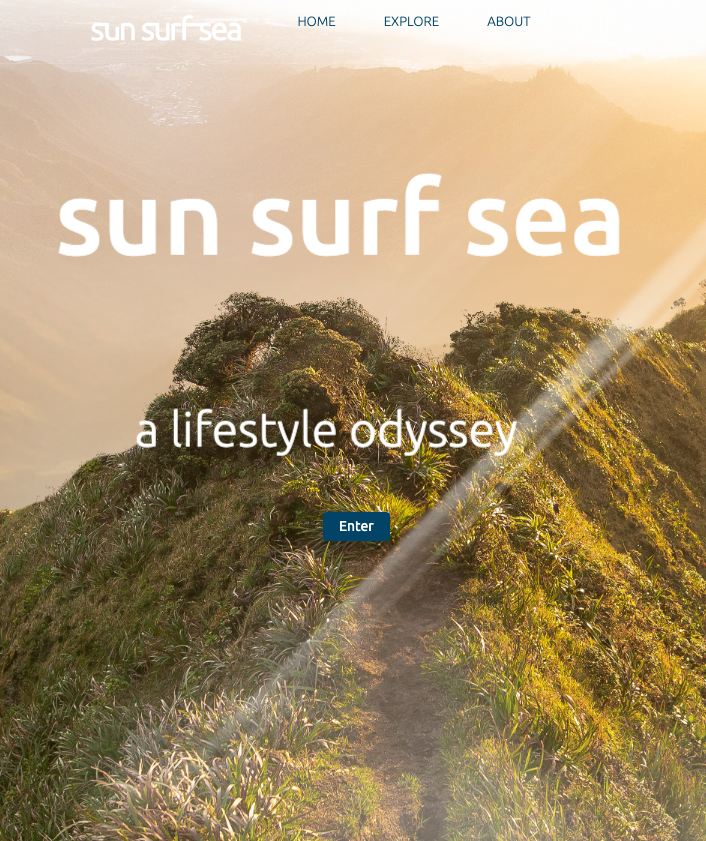
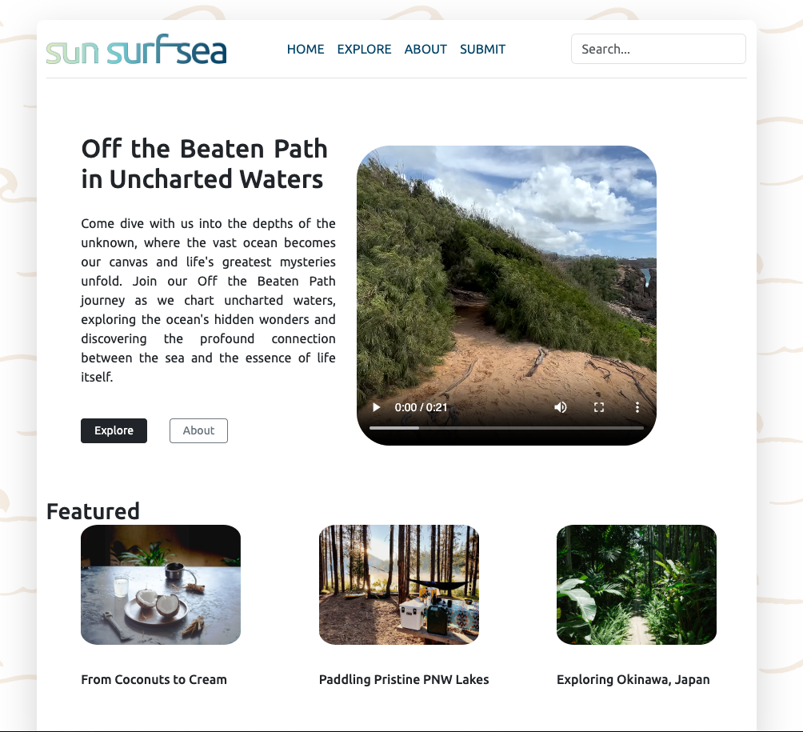
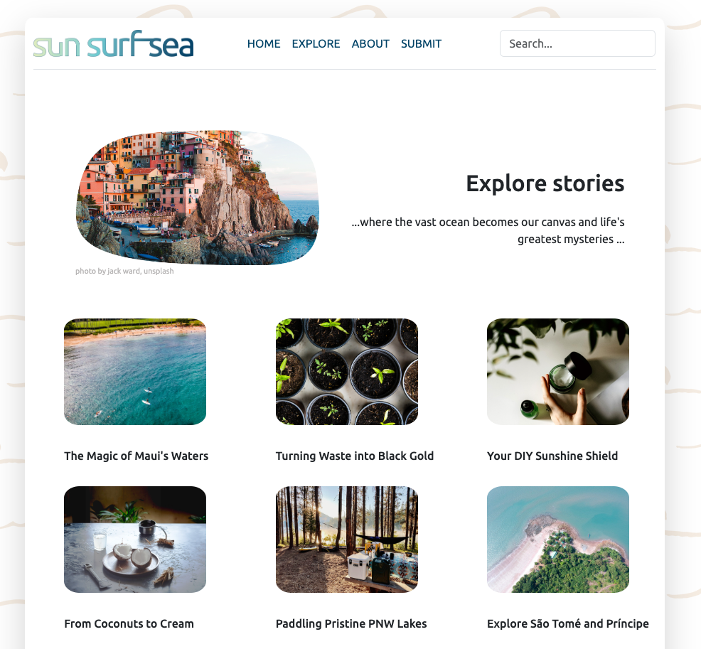
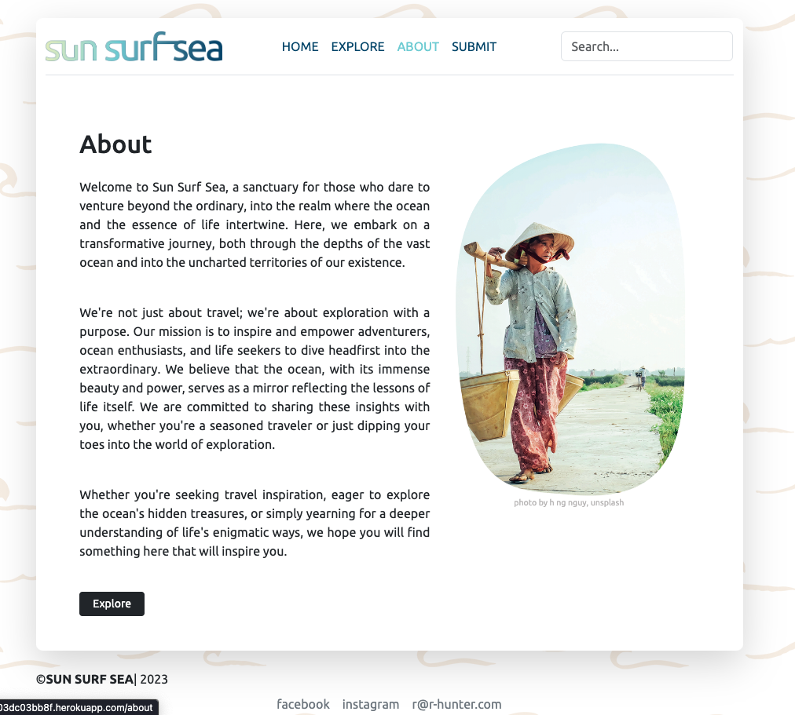
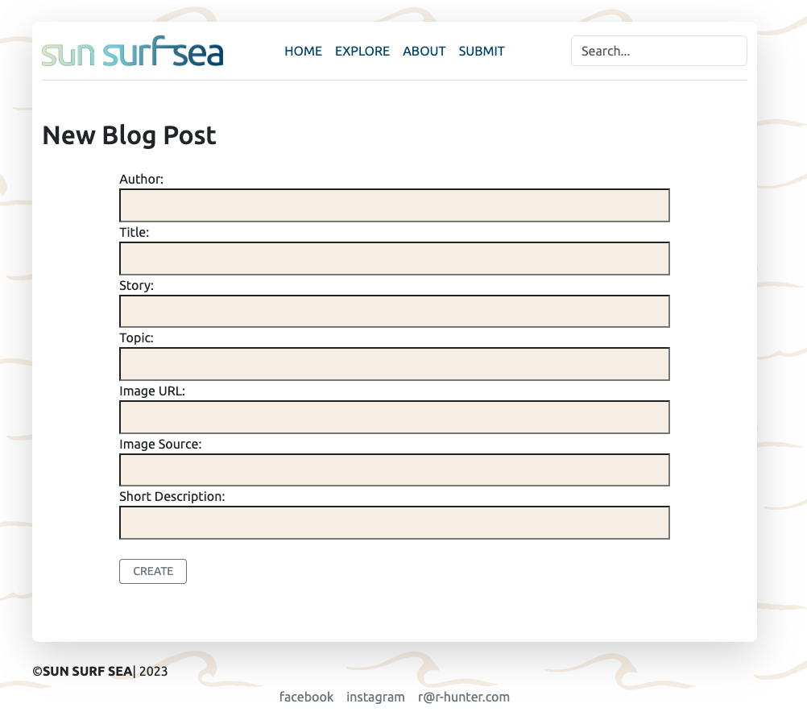

## SUN SURF SEA: MEN-Stack CRUD App

Sun Surf Sea is a full stack application built from scratch using MongoDB/Mongoose, Express, NodeJS, EJS and CSS.

The project is a responsive application designed for a blog website. The website showcases a selection of blog titles and includes a prominent featured section. An engaging introduction informs visitors about the purpose of their visit.

Within the application, users have the ability to search for and sort the available blogs using a sort feature. When a user clicks on a blog title, they are redirected to a dedicated detail page where they can access the complete content of the blog. Additionally, they can leave a review of the blog and post new blogs.

## Screen Screenshot of app
>

>

>

>

>

## Installation:

You can access the application hosted on Horoku at the url: https://sun-surf-sea-2503dc03bb8f.herokuapp.com/

- ### Optional Installation Steps: 

> - Clone this github repository in your terminal or command prompt: 
 https://github.com/robinahunter/Sun-Surf-Sea-Blog

> - CD into the app in terminal, install the project dependencies using npm (Node Package Manager):  `npm install` 

> - Open the configuration file and ensure that database connection settings, and configuration options are set correctly.

> - Start the MongoDB server on your local host depending on your following operating system:
> - On macOS or Linux, use the following command: ` sudo service mongod start`, 
> OR 
> - On Windows, open a command prompt with administrator privileges and run: `mongod`.

> - Once MongoDB is running, start the Node.js server by entering `npm start` and you should see output indicating that the server is listening on port 3000.

> - Open a web browser and navigate to `http://localhost:3000`. You should now see the MEN stack application home page.

## Wire Frames:

## GitHub Repository:
This is where you can find a link to the: 

[GitHub project Url https://github.com/robinahunter/Sun-Surf-Sea-Blog](https://github.com/robinahunter/Sun-Surf-Sea-Blog)

## User Stories

>As someone who is constantly on the move, seeking new experiences in remote coastal areas, I look for blogs that inspire my nomadic lifestyle, offering tips on living, remote coastal destinations, or adventure opportunities that align with my passion. I stumbled upon the blog “Sun, Surf, Sea” which promises not your average guides and off-the-beaten-path content. This blog appears to be the perfect platform to gather tips and knowledge about discovering offbeat coastal areas while engaging in our favorite water sports.

>As a health and wellness enthusiast who values physical and mental well-being, I seek information on how engaging in water sports and nature can contribute to my overall well-being. This blog site has become a valuable resource in my journey to improve my overall well-being through water and nature.

>As a photography my passion lies in capturing the beauty of underwater environments. I constantly seek tips and inspiration to enhance my skills, especially in the realm of underwater and action photography. I often struggle to find resources that cater to my specific interests in capturing the dynamic and breathtaking underwater world. General photography blogs don't always offer inspiration for my unique photography and videography interests. I return to the blog regularly to find fresh ideas for my passion.

>As someone who is always seeking unique experiences, I am particularly interested in unconventional destinations and activities. I often struggle to discover new experiences beyond the typical tourist spots. I came across  “Sun, Surf, Sea”  and became a regular reader of the blog for the off-the-beaten-path content. I have enjoyed learning of some lesser-known destination and it has offered tips and inspiration when planning trips.

## Project Route Table :

>

## ERD Showing Model Blog-Post and Model Reviews Relationship: 

>

## Unsolved problems and major hurrdles overcame:

>

## Resources utilized for this project:

ChatGBT Open AI: https://chat.openai.com/

True Coder, Creative Coding Tutorial:
https://www.youtube.com/watch?v=Yo3j_Dx4u7c

Raddy, Build a Recipe Blog using Node.js and MongoDB:
https://www.youtube.com/watch?v=OEdPH4fV7vY

Scott Draper, General Assembly, CSS transitions
https://git.generalassemb.ly/SEIR-Phoenix/CSS-Fundamentals/blob/main/Labs/2.%20Page%20Transitions.md

w3schools video tag
https://www.w3schools.com/tags/tag_video.asp
